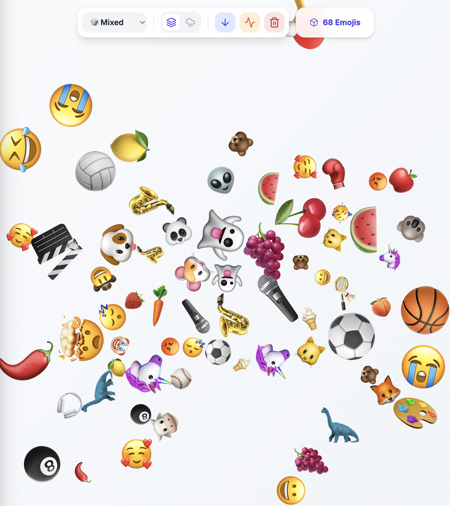

# Emoji Splash

An interactive physics playground where emojis burst from your cursor and interact with realistic collision physics. Built with **React**, **Matter.js**, and **Tailwind CSS**, this playful app brings expressive emojis to life with gravity, bouncing, and drag interactions!

Shake the board!

## 🎮 Features

### Interactive Physics Playground

- **Click & Hold** - Spawn continuous streams of emojis from your cursor
- **Drag Emojis** - Pick up and throw emojis around the canvas
- **Real Physics** - Realistic gravity, collision, and bouncing effects powered by Matter.js
- **High DPI Support** - Crisp rendering on retina displays

### Two Play Modes

- **Pile Mode** - Emojis accumulate at the bottom, creating satisfying emoji mountains
- **Rain Mode** - Emojis fall through the screen continuously, with automatic cleanup for endless rain

### Emoji Categories

Choose from **different emoji sets** with 70+ unique emojis:

- 🎲 **Mixed** - All emojis combined for maximum variety
- 😀 **Faces** - Expressions from happy to spooky
- 🍔 **Food** - Fruits, veggies, and treats
- 🦊 **Animals** - Cute creatures from dogs to dinosaurs
- ⚽ **Sports** - Balls, instruments, and activities

### Control Panel

- **Category Selector** - Switch emoji themes on the fly
- **Mode Toggle** - Switch between Pile and Rain modes
- **Gravity Toggle** - Turn gravity on/off for zero-gravity fun
- **Shake Button** - Give all emojis a random impulse burst
- **Clear Button** - Remove all emojis and start fresh
- **Live Counter** - Displays total emoji count in real-time

## Technical Highlights

- **Custom Physics Renderer** - Hand-crafted canvas rendering loop for smooth 60fps performance
- **Matter.js Integration** - Industry-standard 2D physics engine
- **Dynamic Emoji Spawning** - Variable sizes (15-45px) with randomized velocities
- **Responsive Design** - Automatically adjusts to window resizing
- **Touch Support** - Works seamlessly on mobile and desktop
- **Boundary Management** - Invisible walls keep emojis contained (with mode-specific ground behavior)
- **Efficient Cleanup** - Automatic emoji removal in Rain mode to maintain performance

## Technologies Used

- **React 19.2.3** - UI framework with hooks
- **Matter.js 0.20.0** - 2D physics engine
- **Lucide React** - Clean icon set
- **Tailwind CSS** - Utility-first styling
- **Vite** - Lightning-fast build tool
- **TypeScript** - Type safety and better DX
